# カスタマーサクセス 方針・体制・ロードマップ

---

# Part 1: シンプル版

## ミッション

> **顧客の"かかりつけ医"として、成果の創出を軸に伴走支援する**

## 行動指針

> 普通の医者は、受診しに来た患者を対応するだけ。
> かかりつけ医は違う。
> **定期検診**を通して健康状態を定量的に**ハカり**、定性的に**ミて**、カルテと処方箋を**カく**。

```
┌──────────────────────────────────────────────────────────────────┐
│                                                                  │
│   ハカる                                                         │
│   ├─ 測る：数値で定量的に計測する（KPI・ヘルススコア）           │
│   └─ 図る：基準と計画を設計する（セグメント・目標設定）         │
│                                                                  │
│   ミる                                                           │
│   ├─ 観る：広く全体の状況を観察する（利用状況・定期接点）       │
│   └─ 診る：個別に深く診断する（予兆検知・課題特定）            │
│                                                                  │
│   カく                                                           │
│   ├─ 書く：事実と記録を残す（カルテ＝Salesforce）              │
│   └─ 描く：未来の改善提案を示す（処方箋＝テンプレート・提案）  │
│                                                                  │
└──────────────────────────────────────────────────────────────────┘
```

## 全体構造（1-3-6）

```mermaid
graph TD
    M["🏥 ミッション<br/>顧客の"かかりつけ医"として<br/>成果の創出を軸に伴走支援する"]

    M --> H["ハカる"]
    M --> Mi["ミる"]
    M --> K["カく"]
    M --> B["支える基盤"]

    H --> H1["測る<br/>数値で定量的に計測する"]
    H --> H2["図る<br/>基準と計画を設計する"]

    Mi --> Mi1["観る<br/>広く全体を観察する"]
    Mi --> Mi2["診る<br/>個別に深く診断する"]

    K --> K1["書く<br/>事実と記録を残す"]
    K --> K2["描く<br/>未来の改善提案を示す"]

    H1 --> H1a["1.1 結果指標"]
    H1 --> H1b["1.2 先行指標"]
    H1 --> H1c["1.3 活動指標"]
    H1 --> H1d["1.4 ヘルススコア"]

    H2 --> H2a["2.1 顧客セグメンテーション"]
    H2 --> H2b["2.2 担当割り振り基準"]
    H2 --> H2c["2.3 ライフサイクル設計"]

    Mi1 --> Mi1a["3.1 利用状況モニタリング"]
    Mi1 --> Mi1b["3.2 定期接点 QBR"]
    Mi1 --> Mi1c["3.3 定期メール配信"]

    Mi2 --> Mi2a["4.1 解約予兆検知"]
    Mi2 --> Mi2b["4.2 解約リカバリー"]
    Mi2 --> Mi2c["4.3 アップセル機会発見"]

    K1 --> K1a["5.1 Salesforce一元化"]
    K1 --> K1b["5.2 ナレッジ管理"]

    K2 --> K2a["6.1 テンプレート整備"]
    K2 --> K2b["6.2 オンボーディング動画"]
    K2 --> K2c["6.3 オンボーディングフロー"]
    K2 --> K2d["6.4 メディアサイト"]

    B --> B1["7.1 組織体制"]
    B --> B2["7.2 他部門連携"]
    B --> B3["7.3 リスク管理"]
    B --> B4["7.4 ロードマップ"]

    style M fill:#1a1a2e,color:#fff,stroke:#e94560
    style H fill:#e94560,color:#fff
    style Mi fill:#0f3460,color:#fff
    style K fill:#16213e,color:#fff
    style B fill:#533483,color:#fff
    style H1 fill:#ff6b6b,color:#fff
    style H2 fill:#ff9f43,color:#fff
    style Mi1 fill:#48dbfb,color:#1a1a2e
    style Mi2 fill:#0abde3,color:#fff
    style K1 fill:#576574,color:#fff
    style K2 fill:#222f3e,color:#fff
```

## 目標

| 指標 | 現状 | 目標 |
|------|------|------|
| チャーン率（2年以内） | 約21% | **10%以下** |
| NRR（既存顧客収益維持率） | 未計測 | **100%以上** |

## 体制

```
糸谷（部長）─── 嘉生（MGR）─┬─ 津田 ─── 30社
    8社                     ├─ 鈴木 ─── 30社
                            ├─ 高見 ─── 25社（4月〜）
                            └─ 酒井 ─── 25社（3/15入社）
    連携
    ├─ 盛島（事業開発）── 8社（金融エンプラ）
    └─ 山田（営業兼務）── 3社（コンサル型検証）
```

## これからやること（重点施策）

| No | 施策 | 行動指針 | 完了目標 |
|----|------|---------|---------|
| 1 | テンプレート整備 | 描く | 2月末 |
| 2 | オンボーディング動画制作（12本） | 描く | 3月末 |
| 3 | ヘルススコア運用開始 | 測る | 2月中旬 |
| 4 | Salesforce情報一元化 | 書く | 3月末 |
| 5 | 担当制導入（30社/人上限） | 観る | 2/1開始済 |
| 6 | 解約予兆検知の自動化 | 診る | 2月下旬 |

---

# Part 2: 詳細版

## 全体ロジックツリー（1-3-6-x）

```mermaid
graph TD
    M["🏥 ミッション<br/>顧客の&quot;かかりつけ医&quot;として<br/>成果の創出を軸に伴走支援する"]

    M --> H["🔬 ハカる<br/>成果を定義し、計測し、計画する"]
    M --> Mi["👁 ミる<br/>顧客の状態を観察し、診断する"]
    M --> K["📋 カく<br/>カルテと処方箋を記録・提示する"]
    M --> B["🏗 支える基盤"]

    H --> H1["測る<br/>数値で定量的に計測する"]
    H --> H2["図る<br/>基準と計画を設計する"]

    Mi --> Mi1["観る<br/>広く全体の状況を観察する"]
    Mi --> Mi2["診る<br/>個別に深く診断する"]

    K --> K1["書く<br/>事実と記録を残す"]
    K --> K2["描く<br/>未来の改善提案を示す"]

    H1 --> H1a["1.1 結果指標<br/>チャーン率・NRR・転換率"]
    H1 --> H1b["1.2 先行指標<br/>ヘルススコア・アクティブ率・接点頻度"]
    H1 --> H1c["1.3 活動指標<br/>MTG数・QBR実施率・提案数"]
    H1 --> H1d["1.4 ヘルススコア<br/>6指標・100点満点"]

    H2 --> H2a["2.1 顧客セグメンテーション<br/>S/A/B/C"]
    H2 --> H2b["2.2 担当割り振り基準"]
    H2 --> H2c["2.3 顧客ライフサイクル設計<br/>5フェーズ"]

    Mi1 --> Mi1a["3.1 利用状況モニタリング<br/>SF自動インポート"]
    Mi1 --> Mi1b["3.2 定期接点<br/>QBR＝定期検診"]
    Mi1 --> Mi1c["3.3 定期メール配信"]

    Mi2 --> Mi2a["4.1 解約予兆検知<br/>異変の早期発見"]
    Mi2 --> Mi2b["4.2 解約リカバリー<br/>治療プラン"]
    Mi2 --> Mi2c["4.3 アップセル機会の発見"]

    K1 --> K1a["5.1 Salesforce情報一元化<br/>カルテ"]
    K1 --> K1b["5.2 ナレッジ管理<br/>症例集"]

    K2 --> K2a["6.1 テンプレート整備<br/>処方箋の標準化"]
    K2 --> K2b["6.2 オンボーディング動画<br/>治療ガイド"]
    K2 --> K2c["6.3 オンボーディングフロー<br/>初診・治療計画"]
    K2 --> K2d["6.4 メディアサイト<br/>セルフケアガイド"]

    B --> B1["7.1 組織体制"]
    B --> B2["7.2 他部門連携"]
    B --> B3["7.3 リスク管理"]
    B --> B4["7.4 ロードマップ"]

    style M fill:#1a1a2e,color:#fff,stroke:#e94560,stroke-width:3px
    style H fill:#e94560,color:#fff
    style Mi fill:#0f3460,color:#fff
    style K fill:#16213e,color:#fff
    style B fill:#533483,color:#fff
    style H1 fill:#ff6b6b,color:#fff
    style H2 fill:#ff9f43,color:#fff
    style Mi1 fill:#48dbfb,color:#1a1a2e
    style Mi2 fill:#0abde3,color:#fff
    style K1 fill:#576574,color:#fff
    style K2 fill:#222f3e,color:#fff
    style B1 fill:#8854d0,color:#fff
    style B2 fill:#8854d0,color:#fff
    style B3 fill:#8854d0,color:#fff
    style B4 fill:#8854d0,color:#fff
```



---

## ハカる（測る・図る）

> **測る** = 数値で定量的に計測する。体温、血圧、血液検査のように、顧客の健康状態を数字で把握する。
> **図る** = 基準と計画を設計する。治療方針や検診計画のように、どの患者にどう向き合うかの戦略を立てる。

---

### 測る：数値で定量的に計測する

#### 1.1 結果指標（最終的な健康状態）

| 指標 | 定義 | 現状 | 目標 | 測定頻度 |
|------|------|------|------|---------|
| チャーン率 | 2年以内解約顧客数/契約顧客数 | 約21% | 10%以下 | 月次 |
| NRR | (期首MRR+アップセル-DG-解約)/期首MRR | 未計測 | 100%以上 | 四半期 |
| パイプライン転換率 | 開催→申込→参加→アンケート→商談 | 未計測 | 前年比+10% | 月次 |

#### 1.2 先行指標（健康診断の数値）

| 指標 | 目標 | 測定頻度 |
|------|------|---------|
| ヘルススコア平均 | 70点以上 | 週次 |
| 🔴顧客比率 | 5%以下 | 週次 |
| 月間アクティブ顧客率 | 80%以上 | 月次 |
| セグメント別接点頻度達成率 | 90%以上 | 月次 |

#### 1.3 活動指標（かかりつけ医の活動量）

| 指標 | 目標 | 測定頻度 |
|------|------|---------|
| 顧客MTG数 | 担当社数×0.5回/月 | 月次 |
| QBR実施率（S/Aセグメント） | 80%以上 | 四半期 |
| オンボーディング完了率 | 100% | 月次 |
| アップセル提案数 | 10件/月以上 | 月次 |

#### 1.4 ヘルススコア（健康診断の数値化）

| カテゴリ | 指標 | 配点 | 算出方法 |
|---------|------|------|---------|
| 利用状況 | 月間配信数 | 25点 | 0回=0, 1-2回=15, 3回以上=25 |
| 利用状況 | 月間ログイン日数 | 15点 | 0日=0, 1-5日=8, 6日以上=15 |
| エンゲージメント | 直近接点からの日数 | 20点 | 60日以上=0, 30-59日=10, 30日未満=20 |
| エンゲージメント | MTG実施状況 | 10点 | 四半期MTGなし=0, あり=10 |
| 成果 | パイプライン転換率 | 20点 | 平均以下=5, 平均=12, 平均以上=20 |
| 契約 | 更新までの日数 | 10点 | 3M以内=10, 3-6M=7, 6M以上=5 |

| スコア | 状態 | 対応 |
|--------|------|------|
| 80-100 | 🟢 健全 | 通常対応・アップセル探索 |
| 60-79 | 🟡 要注意 | 接点強化・課題ヒアリング |
| 40-59 | 🟠 警戒 | 即時介入・改善プラン提示 |
| 0-39 | 🔴 危険 | 緊急対応・MGRエスカレーション |

---

### 図る：基準と計画を設計する

#### 2.1 顧客セグメンテーション

| セグメント | 定義 | 担当上限 | 接点頻度 |
|-----------|------|---------|---------|
| **S（Strategic）** | 年間500万以上/エンプラ | 5-8社/人 | 月1回以上 |
| **A（Growth）** | 年間100-500万、成長余地大 | 10-15社/人 | 四半期1回以上 |
| **B（Stable）** | 年間100万未満、安定利用 | 15-20社/人 | 半年1回以上 |
| **C（Low-touch）** | 利用頻度低 | 20-30社/人 | 年1回以上 |

#### 2.2 担当割り振り基準

**顧客属性による工数判定**

| 要素 | 高工数 | 低工数 |
|-----|--------|--------|
| 業種 | 金融・医療 | 一般企業 |
| 規模 | エンタープライズ | SMB |
| 利用フェーズ | 導入初期・拡大期 | 安定期 |
| 利用機能 | 複数・カスタマイズ多 | 標準利用 |

**担当者特性によるマッチング**

| 要素 | 考慮点 |
|-----|-------|
| 経験年数 | 新人は低工数から |
| 得意領域 | 業種・技術でマッチング |
| キャパシティ | 兼務状況を考慮 |
| 相性 | 1年単位で見直し |

**割り振りシミュレーション（170社）**

| 担当 | S | A | B | C | 合計 |
|-----|---|---|---|---|------|
| 嘉生 | 3 | 8 | 10 | - | 21 |
| 津田 | 2 | 10 | 15 | 3 | 30 |
| 鈴木 | 2 | 10 | 15 | 3 | 30 |
| 高見 | 1 | 8 | 12 | 4 | 25 |
| 酒井 | - | 5 | 12 | 8 | 25 |
| 糸谷 | 3 | 3 | 2 | - | 8 |
| 盛島 | 5 | 3 | - | - | 8 |
| 山田 | - | 3 | - | - | 3 |
| **計** | **16** | **50** | **66** | **18** | **150** |

#### 2.3 顧客ライフサイクル設計

```
契約 → 導入期 → 活用期 → 拡大期 → 成熟期 → 更新期
       (0-3M)   (3-6M)   (6-12M)  (12M〜)  (更新2M前)
         │        │        │        │        │
       初診     経過観察   精密検査  定期検診  更新判断
```

| フェーズ | ゴール | 主要アクション |
|---------|-------|---------------|
| **導入期**（0-3ヶ月） | 初回配信成功 | キックオフ、初期設定代理、動画案内、初回配信支援 |
| **活用期**（3-6ヶ月） | 定期配信定着 | 月次利用状況確認、改善提案、3ヶ月レビュー |
| **拡大期**（6-12ヶ月） | 利用範囲拡大 | 6ヶ月レビュー、アップセル提案、他部門展開 |
| **成熟期**（12ヶ月〜） | ロイヤル化 | QBR、事例化依頼、紹介依頼 |
| **更新期**（更新2ヶ月前〜） | 契約更新 | 更新意向確認、成果サマリー提供 |

---

## ミる（観る・診る）

> **観る** = 広く全体の状況を観察する。定期検診のように、すべての患者の健康状態を継続的に把握し続ける。
> **診る** = 個別に深く診断する。異変を感じた患者に対して精密検査を行い、原因を特定し、対処する。

---

### 観る：広く全体の状況を観察する

#### 3.1 利用状況モニタリング

| 監視対象 | データソース | SF取込頻度 |
|---------|-------------|-----------|
| 配信数・視聴数 | ネクプロ→Metabase | 週次 |
| ログイン状況 | ネクプロ→Metabase | 週次 |
| 会員数・ポイント | ネクプロ→Metabase | 週次 |
| データ転送量 | ネクプロ | 月次 |

#### 3.2 定期接点（QBR＝定期検診）

| 対象 | S：必須、A：推奨、B/C：希望者のみ |
|-----|--------------------------------|

**QBRアジェンダ（60分）**

| 時間 | 内容 | 医療でいうと |
|-----|------|-------------|
| 0-5分 | アイスブレイク | 挨拶・問診前の声かけ |
| 5-15分 | 前四半期の成果振り返り | 検査結果の説明 |
| 15-25分 | 課題ディスカッション | 問診 |
| 25-40分 | 次四半期のゴール設定 | 治療計画の策定 |
| 40-50分 | ネクプロからの提案 | 処方箋の発行 |
| 50-60分 | 質疑応答・次回日程 | 次回の検診予約 |

#### 3.3 定期メール配信

| 配信名 | 頻度 | 内容 |
|-------|------|------|
| 活用Tipsメール | 月次 | ノウハウ・事例紹介 |
| 新機能リリース通知 | 随時 | 新機能の案内 |
| 更新リマインド | 更新2ヶ月前 | 更新手続きの案内 |

---

### 診る：個別に深く診断する

#### 4.1 解約予兆検知（異変の早期発見）

| 予兆シグナル | 検知方法 | 重要度 |
|-------------|---------|-------|
| 60日以上ログインなし | SF自動検知 | 🔴 高 |
| 配信数が前月比50%以下 | SF自動検知 | 🟠 中 |
| クレーム・問い合わせ増加 | サポート連携 | 🟠 中 |
| 担当者変更 | 顧客連絡 | 🟡 低-中 |
| 競合検討の情報 | 営業共有 | 🔴 高 |

**介入フロー**

```
予兆検知 → Slack通知 → 48時間以内に接触 → 状況ヒアリング
                                              │
                        ┌─────────────────────┼──────────────────┐
                        ▼                     ▼                  ▼
                   課題なし               課題あり           解約意向あり
                   →経過観察             →改善提案          →リカバリー
                                                            →MGRエスカレーション
```

#### 4.2 解約リカバリー（治療プラン）

| 解約理由 | 対応（処方） |
|---------|-------------|
| 施策終了・中止（全体の74%） | 別用途提案（社内研修、採用等）、次期施策の相談 |
| コスト | ROI可視化、プラン見直し |
| 機能不足 | 代替機能提案、開発ロードマップ共有 |
| 担当者変更 | 新担当者へオンボーディング再実施 |

#### 4.3 アップセル機会の発見

| トリガー | アクション |
|---------|-----------|
| 利用量が上限に近い | プランアップグレード提案 |
| 配信頻度が増加 | 追加ライセンス提案 |
| 他部門での利用検討 | 部門展開支援 |
| 成果が出ている（QBRで確認） | 活用範囲拡大提案 |

---

## カく（書く・描く）

> **書く** = 事実と記録を残す。カルテのように、顧客の状態・対応履歴・変化を正確に記録し、誰が見ても状況がわかる状態にする。
> **描く** = 未来の改善提案を示す。処方箋のように、顧客の課題に対する解決策や次のステップを具体的に提示する。

---

### 書く：事実と記録を残す

#### 5.1 Salesforce情報一元化（カルテ）

**方針：** 全顧客情報をSFに集約。Notion・Circlebackの使用を段階的に廃止。

| 記録対象 | 方法 |
|---------|------|
| メール履歴 | SF連携で自動記録 |
| MTG議事録 | Gemini/Minutes→SF保存 |
| 利用状況データ | Metabase→SF週次インポート |
| ヘルススコア | SF自動算出 |
| 対応履歴 | 担当CSが都度記録 |

**SF運用3原則：**
1. 顧客に関する情報はSF以外に書かない
2. 対応後は当日中にSFに記録する
3. 急な休み・担当不在でもチームで対応できる状態を維持する

#### 5.2 ナレッジ管理（症例集）

| ナレッジ | 管理場所 | 更新頻度 |
|---------|---------|---------|
| 顧客対応履歴（カルテ） | Salesforce | 都度 |
| 動画コンテンツ | YouTube限定→メディアサイト | 随時 |
| テンプレート | Googleドライブ→メディアサイト | 随時 |
| FAQ | Salesforce Knowledge | 月次 |
| 成功事例（症例報告） | SF+社内Wiki | 発生時 |

**事例蓄積フロー：**
```
成果発生 → SFに簡易記録 → 月次MTGで共有
→ 事例化判定 → 顧客に取材依頼 → ドキュメント作成 → 横展開
```

**共有の仕組み：**

| 仕組み | 頻度 | 内容 |
|-------|------|------|
| 週次CSミーティング | 週1 | 困りごと共有、🟠🔴顧客確認 |
| 月次ナレッジ共有会 | 月1 | 成功事例発表、Tips共有 |
| 四半期振り返り | 四半期 | KPI振り返り、改善施策検討 |

---

### 描く：未来の改善提案を示す

#### 6.1 テンプレート整備（処方箋の標準化）

| テンプレート | 内容 | 担当 | 完了目標 |
|-------------|------|------|---------|
| 配信設定 | ライブ/疑似ライブ/オンデマンド 3パターン | 津田 | 2月上旬 |
| キャンペーンページ | シンプル型/リッチ型 2パターン | 津田 | 2月中旬 |
| セミナー構成 | 本数・アンケート・ステップメール | 津田 | 2月中旬 |
| ヒアリングシート | 営業→CS引継ぎ用 | 津田 | 2月上旬 |
| QBRテンプレート | アジェンダ・準備物 | 嘉生 | 2月末 |
| サムネイル | 3デザインパターン | 津田 | 2月下旬 |

#### 6.2 オンボーディング動画（治療ガイド）

**Phase 1（6本・2月末完成）：基本操作**

| No | タイトル | 対象 | 時間 |
|----|---------|------|------|
| 1 | 管理画面の基本操作 | 全共通 | 5分 |
| 2 | ライブ配信の設定と実施 | ライブ | 10分 |
| 3 | 疑似ライブの設定と実施 | 疑似ライブ | 8分 |
| 4 | オンデマンド配信の設定 | オンデマンド | 8分 |
| 5 | キャンペーンページの作成 | 全共通 | 10分 |
| 6 | アンケートの設定と活用 | 全共通 | 7分 |

**Phase 2（6本・3月末完成）：応用活用**

| No | タイトル | 対象 | 時間 |
|----|---------|------|------|
| 7 | セミナー集客の成功パターン | セミナー | 10分 |
| 8 | ステップメールの設計と設定 | 全共通 | 8分 |
| 9 | 視聴データの分析と活用 | 全共通 | 8分 |
| 10 | Salesforce連携の設定 | SF利用企業 | 10分 |
| 11 | 大規模配信の準備と注意点 | 大規模 | 8分 |
| 12 | 社内研修での活用方法 | 社内研修 | 7分 |

#### 6.3 オンボーディングフロー（初診・治療計画）

```
Step0 → Step1 → Step2 → Step3 → Step4 → 自走
事前設定  キックオフ  動画視聴  配信前     振り返り
(代理)   (MTG)     (非同期)  チェック   (MTG)
                              (MTG)
  │       │        │        │        │
 初期設定  ゴール設定 機能学習  最終調整  成果確認
 代理完了  運用相談          Q&A     改善提案
```

| ステップ | タイミング | 内容 |
|---------|-----------|------|
| Step0 | 契約後〜キックオフ前 | 初期設定を代理で完了 |
| Step1 | 契約後1週間以内 | ゴール設定・運用方針の相談 |
| Step2 | Step1後〜配信前 | 動画で機能学習（非同期） |
| Step3 | 初回配信1週間前 | 設定確認・最終調整・Q&A |
| Step4 | 初回配信後1週間以内 | 成果振り返り・改善提案 |

**暫定対応（メディアサイト完成前）：**

| コンテンツ | 暫定 | 本格（メディアサイト後） |
|-----------|------|----------------------|
| 機能説明動画 | YouTube限定公開→URL送付 | メディアサイトに統合 |
| マニュアル | 既存サイト+PDF補完 | ステップ形式で再構成 |
| テンプレート | Googleドライブ共有 | メディアサイトからDL |

#### 6.4 メディアサイト（セルフケアガイド）

**位置づけ：** 顧客が自分で調べ、自分で解決できる「セルフケアガイド」

**統合するコンテンツ：**
- マニュアル（操作方法）
- オンボーディング動画（学習コンテンツ）
- テンプレート（すぐ使える素材）
- 事例・ベストプラクティス（成功パターン）
- FAQ（よくある質問）

**担当：** 嘉生（PJリーダー）
**優先度：** 計画的に進行（テンプレート・動画が先）

---

## 支える基盤

---

### 7.1 組織体制

```
┌──────────────────────────────────────────────────────────────┐
│ 糸谷（執行役員 兼 CS部部長）── 8社担当 + 全体統括           │
├──────────────────────────────────────────────────────────────┤
│ 嘉生（CSマネージャー）── 21社担当                           │
│   ├─ 津田 ─── 30社（テンプレート整備担当）                 │
│   ├─ 鈴木 ─── 30社（動画制作担当）                         │
│   ├─ 高見 ─── 25社（2月〜徐々に、4月本格稼働）             │
│   └─ 酒井 ─── 25社（3/15入社、4月〜段階的）               │
├──────────────────────────────────────────────────────────────┤
│ 連携メンバー                                                │
│   ├─ 盛島（事業開発MGR）── 8社（金融エンプラ深耕）          │
│   └─ 山田（新規営業メイン）── 3社（コンサル型CS検証）       │
├──────────────────────────────────────────────────────────────┤
│ 合計：約150社（残り20社は新規バッファ）                      │
└──────────────────────────────────────────────────────────────┘
```

**酒井さん育成計画**

| 期間 | 内容 | ゴール |
|------|------|-------|
| 1ヶ月目（3/15〜4/14） | サポート対応、MTG同席 | 基本的な問い合わせに回答できる |
| 2ヶ月目（4/15〜5/14） | 担当5→10社、オンボーディング補助 | 自分で顧客対応できる |
| 3ヶ月目以降 | 担当25社まで拡大 | 一人前のCS |

---

### 7.2 他部門連携

```
                 ┌────────┐
                 │ 経営層 │ ← 月次KPI報告
                 └───┬────┘
    ┌────────────────┼────────────────┐
    ▼                ▼                ▼
┌────────┐     ┌────────┐     ┌────────┐
│ 営業   │ ←→ │  CS   │ ←→ │ 開発  │
└────────┘     └───┬────┘     └────────┘
                    │
         ┌──────────┼──────────┐
         ▼          ▼          ▼
    ┌────────┐ ┌────────┐ ┌────────┐
    │サポート│ │マーケ  │ │ 管理  │
    └────────┘ └────────┘ └────────┘
```

| 連携先 | CS→連携先 | 連携先→CS | 頻度 |
|-------|----------|----------|------|
| 営業 | アップセル機会共有 | 顧客引継ぎ | 随時+月1合同MTG |
| 開発 | 顧客要望FB | 新機能リリース情報 | 月1+随時 |
| サポート | - | 問い合わせ傾向、クレーム | 週1 |
| マーケ | 事例取材可能顧客 | - | 随時 |
| 経営層 | KPIレポート | - | 月1 |

---

### 7.3 リスク管理

| リスク | 影響度 | 対応策 |
|-------|-------|-------|
| Sセグメント顧客の解約 | 🔴 高 | ヘルススコア監視、早期介入、役員エスカレーション |
| 主要担当者の離職 | 🔴 高 | SF情報集約、引継ぎチェックリスト |
| 複数顧客の同時解約 | 🔴 高 | 解約予兆の早期検知、四半期レビュー |
| 新メンバーの立ち上げ遅延 | 🟡 中 | メンター制度、育成チェックリスト |
| システム障害 | 🟡 中 | 緊急連絡フロー、顧客通知テンプレート |
| 担当不在時の対応 | 🟢 低 | SF情報共有、チーム対応体制 |

---

### 7.4 ロードマップ

```
1月              2月               3月               4月
│                │                 │                 │
1/20             2/1               3/15              4/1
割り振りMTG      担当制開始         酒井入社           本格稼働
                 │                 │                 │
                 2/28              3/31              高見25社
                 動画Phase1(6本)   動画Phase2(12本)   酒井段階的
                 テンプレート完成
```

| Phase | 期間 | やること | 行動指針 |
|-------|------|---------|---------|
| **Phase 1: 基盤構築** | 1-2月 | 担当制開始、テンプレート整備、動画6本、ヘルススコア設計 | 測る+描く |
| **Phase 2: 仕組み化** | 3月 | 酒井入社、動画12本完成、SF連携完了、検知自動化 | 観る+書く |
| **Phase 3: 拡充** | 4月〜 | 本格稼働、メディアサイト、コンサル型CS展開、NRR測定 | 全て |

---

## CSの範囲定義

| やること | やらないこと |
|---------|-------------|
| 成果創出に向けた伴走支援 | 技術的なバグ修正（→開発） |
| オンボーディング・活用支援 | 新規顧客への営業活動（→営業） |
| 解約防止の能動的アプローチ | 請求・契約事務（→管理） |
| アップセル機会の発見・提案 | 24時間緊急対応（→サポート） |
| 顧客要望のプロダクトFB | 個別カスタマイズ開発 |

---

## NRRについて（補足）

**なぜMRRではなくNRRか：**
- MRRは新規獲得の影響を受け、CSの貢献が見えにくい
- NRRは既存顧客に限定するため、CS活動（解約防止+アップセル）が直接反映される
- NRR 100%以上 = 新規なしでも成長できる状態

```
NRR = (期首MRR + アップセル − ダウングレード − 解約) / 期首MRR × 100%
```

---

*最終更新：2025/01/27*
