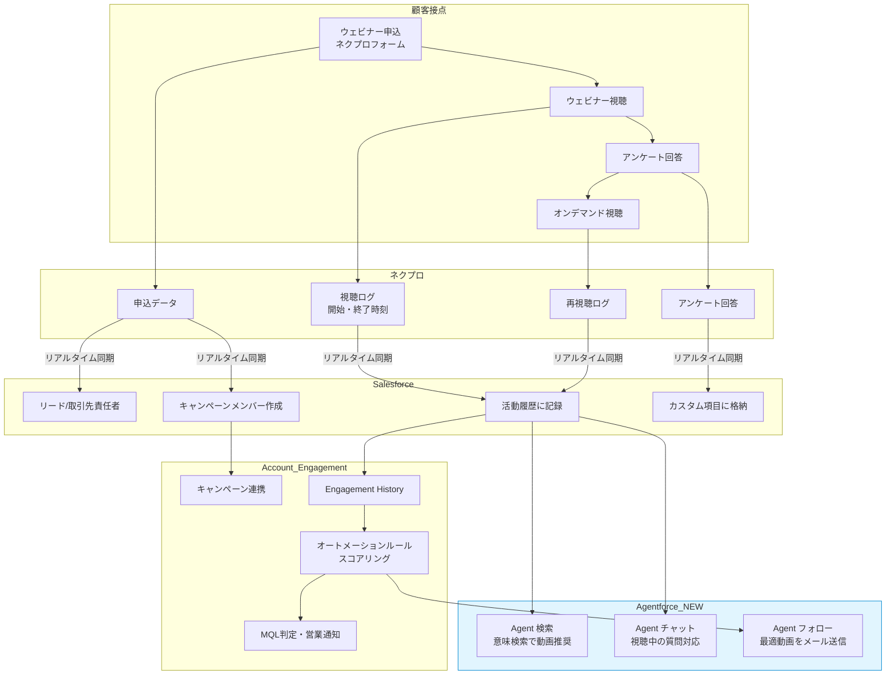

# NTT西日本様向け
# ウェビナープラットフォーム継続利用のご提案
## ～ネクプロ vs EventHub 徹底比較～

---

## 1. エグゼクティブサマリー

### 結論：ネクプロを継続すべき3つの理由

| # | 理由 | インパクト |
|---|------|-----------|
| **1** | **Salesforce連携の公式性・安全性** | AppExchange公認 vs 非公認。NTT基準のセキュリティ審査をクリア済み |
| **2** | **エンゲージメントデータの深度** | 視聴開始・離脱の秒単位ログ取得。EventHubは「参加管理のみ」 |
| **3** | **Agentforce連携による将来性** | AI検索・AIチャット・AIフォローの3機能。EventHubには同等機能なし |

> **推奨アクション**: EventHubへの乗り換えは、Salesforce連携の劣化・移行コスト・将来的なAI活用機会の喪失を招くリスクがあり、推奨しません。

---

## 2. Why NexPro? ～AEフォームだけでは足りない理由～

### 2.1 よくある疑問

> 「Account Engagement（Pardot）のフォームで集客できるのに、なぜネクプロのフォームを挟む必要があるのか？」

### 2.2 回答：エンゲージメントデータの本質的価値

```
┌─────────────────────────────────────────────────────────────────┐
│  AEフォーム単体で取得できるデータ                              │
├─────────────────────────────────────────────────────────────────┤
│  ✓ フォーム送信日時                                            │
│  ✓ 入力された属性情報（会社名、役職等）                        │
│  ✓ ページビュー（申込ページを見た/見ていない）                 │
└─────────────────────────────────────────────────────────────────┘
                              ↓
                    【ここで情報が途切れる】
                              ↓
┌─────────────────────────────────────────────────────────────────┐
│  ネクプロで取得できる追加データ（AE単体では取得不可）          │
├─────────────────────────────────────────────────────────────────┤
│  ✓ 視聴開始時刻・終了時刻（秒単位）                            │
│  ✓ 離脱ポイント（どこで視聴をやめたか）                        │
│  ✓ 視聴時間の累計                                              │
│  ✓ 事前アンケート回答（申込時点での課題・関心）                │
│  ✓ 事後アンケート回答（連動型質問で深堀り可能）                │
│  ✓ チャット発言内容                                            │
│  ✓ 投票・Q&A参加状況                                           │
└─────────────────────────────────────────────────────────────────┘
```

### 2.3 スコアリング・インサイドセールスへの活用

#### シナリオ例：ウェビナー後の追撃アプローチ

| 視聴者タイプ | ネクプロで取得できるデータ | インサイドセールスのアクション |
|-------------|--------------------------|------------------------------|
| **完走者（90%以上視聴）** | 視聴時間、事後アンケート「満足」、チャットで質問あり | 即日架電。「ご質問いただいた○○について詳しくご説明します」 |
| **途中離脱者（50%で離脱）** | 離脱ポイント = 価格説明のスライド | 「価格面でご不明点があれば個別にご説明します」とメール |
| **申込のみ・未視聴** | 視聴時間 = 0分 | オンデマンド視聴リンクを送付。「お忙しかったようですので録画をお送りします」 |

#### AEスコアリングとの連携

```
【ネクプロ → Salesforce → Account Engagement の流れ】

1. ネクプロが視聴ログをリアルタイムでSFキャンペーンメンバーに連携
2. SFの活動履歴に「視聴時間: 45分」「アンケート: 満足」が自動記録
3. AEのオートメーションルールで条件判定
   └ IF 視聴時間 > 30分 AND アンケート = 満足 → スコア +50点
4. スコアが閾値を超えたリードは自動でMQL認定 → 営業に通知
```

**重要**: ネクプロ側にスコアリング機能はありませんが、AE側で上記のようなルールを設定することで実現可能です。

---

## 3. SF連携全体像（1枚絵）

### データフロー図



### 連携のポイント

| 項目 | ネクプロ | EventHub |
|------|---------|----------|
| **連携方式** | AppExchange公認アプリ | 非公認アプリ |
| **連携先オブジェクト** | キャンペーン/キャンペーンメンバー（標準） | カスタムオブジェクト（開発必要） |
| **同期タイミング** | リアルタイム | 不明 |
| **視聴ログの粒度** | 開始・終了時刻（秒単位） | 参加管理のみ |
| **組織リソース消費** | なし（AppExchangeのため） | カスタムオブジェクト/項目数を消費 |

---

## 4. 徹底比較表

### 4.1 配信機能

| 機能 | ネクプロ | EventHub | 評価 |
|------|---------|----------|------|
| ライブ配信 | ○ 自社配信可能（複数登壇対応） | △ Whereby利用（視聴画面はEventHub） | **ネクプロ優位** |
| 擬似ライブ（録画配信） | ○ | ○ | 同等 |
| オンデマンド配信 | ○ | ○ | 同等 |
| 一覧ページ構築 | ○ ノーコードで可能 | × 構築不可 | **ネクプロ優位** |
| 申込ページ | ○ ノーコード | ○ リッチカスタマイズ可能 | EventHubやや優位 |

### 4.2 Salesforce/Account Engagement連携（最重要）

| 項目 | ネクプロ | EventHub | 評価 |
|------|---------|----------|------|
| **提供方式** | AppExchange公認 | 非公認アプリ | **ネクプロ優位** |
| **セキュリティ審査** | Salesforce社の審査認可済み | 審査なし（ブラックボックス） | **ネクプロ優位** |
| **組織リソース** | 消費なし | カスタムオブジェクト/項目数を消費 | **ネクプロ優位** |
| **バージョン管理** | AppExchangeで管理 | 管理なし（問題時はアンインストール） | **ネクプロ優位** |
| **サポート** | 代理ログイン可能 | 画面共有のみ | **ネクプロ優位** |
| **連携対象** | キャンペーン/キャンペーンメンバー | カスタムオブジェクト（開発必要） | **ネクプロ優位** |
| **視聴ログ** | 開始・終了時刻を履歴保持 | 参加管理のみ | **ネクプロ優位** |
| **通知機能** | キャンペーン単位で所有者に通知 | なし | **ネクプロ優位** |
| **AE連携** | フォーム利用可能 | フォーム利用可能 | 同等 |
| **AI機能** | ネクプロ for Agentforce（2025年1月〜） | なし | **ネクプロ優位** |

### 4.3 エンゲージメント機能

| 機能 | ネクプロ | EventHub | 評価 |
|------|---------|----------|------|
| 事前アンケート | ○ 申込時取得可能 | × 不可 | **ネクプロ優位** |
| 事後アンケート | ○ 連動型質問設定可能 | × 不可 | **ネクプロ優位** |
| チャット | ○ | ○ | 同等 |
| 投票・Q&A | ○ | ○ | 同等 |
| 企業単位分析 | ○ 視聴履歴を企業単位で分析可能 | △ 参加管理のみ | **ネクプロ優位** |

### 4.4 セキュリティ・ガバナンス

| 項目 | ネクプロ | EventHub | 評価 |
|------|---------|----------|------|
| **セキュリティ審査実績** | 国内外大手企業100%通過（2024/12時点） | 不明 | **ネクプロ優位** |
| **国際規格** | ISO/IEC 27001:2013取得 | 取得なし | **ネクプロ優位** |
| **Salesforce審査** | 定期的なセキュリティレビュー | 審査なし | **ネクプロ優位** |

### 4.5 コストパフォーマンス

| 項目 | ネクプロ | EventHub |
|------|---------|----------|
| **料金形態** | 月間総視聴時間 + ユニークユーザー数 | 1回のイベント参加者人数上限 |
| **適性** | 大型イベント・人数変動が大きい場合に有利 | 小規模（100名以下）を複数開催する場合に有利 |
| **NTT西日本への適性** | 30府県でオフライン開催＋毎月ウェビナー → **人数変動性が高く相性良い** | - |

---

## 5. SF連携の深化と将来的インパクト

### 5.1 具体的な出力イメージ

#### ユースケース1: 視聴時間トリガーの追撃メール

```
【Salesforce 活動履歴の表示例】

取引先責任者: 山田太郎（NTT西日本）
─────────────────────────────────────────
日時: 2025/01/20 14:00
種別: ウェビナー視聴
件名: 「DX推進セミナー」視聴完了
詳細:
  - 視聴時間: 52分（全体60分）
  - 視聴率: 87%
  - 離脱なし
  - 事後アンケート: 満足
  - 質問: 「導入事例を詳しく知りたい」
─────────────────────────────────────────

↓ AEオートメーションルールで自動判定

【Account Engagement 自動アクション】
  IF 視聴率 > 80% AND アンケート = 満足
  THEN:
    1. スコア +50点 追加
    2. 「高関心リード」タグ付与
    3. 営業担当者に Slack 通知
    4. 翌日AM10:00に事例紹介メールを自動送信
```

#### ユースケース2: 未視聴者へのリマインド

```
【ネクプロ → Salesforce → AE の自動フロー】

1. ウェビナー終了後、ネクプロが「視聴時間=0」のデータをSFに連携
2. キャンペーンメンバーステータス = 「未視聴」に自動更新
3. AEのEngagement Studioで条件分岐:
   └ IF ステータス = 未視聴 → オンデマンドリンク付きメール送信
   └ IF 3日後も未視聴 → 再リマインドメール
   └ IF 視聴完了 → 自動でフロー終了
```

### 5.2 ネクプロ for Agentforce（2025年1月〜）

EventHubには存在しない、ネクプロ独自の**将来的差別化要素**です。

#### 3つのAIエージェント機能

| 機能 | 概要 | 効果 |
|------|------|------|
| **Agent 検索** | 意味検索で最適な動画を要約付きで推奨 | 自己解決率向上、問い合わせ削減 |
| **Agent チャット** | 視聴中の疑問にAIが24/365で回答 | 顧客の興味・関心を可視化 |
| **Agent フォロー** | 顧客課題に合った動画をメールで自動送信 | 営業フォローの標準化・自動化 |

#### 導入効果（ネクプロ社の目標値）

- カスタマーサポート業務: **40%削減**
- セキュリティチェック対応コスト: **300〜500万円削減**

#### 料金体系

| プラン | 月額 | 機能数 |
|--------|------|--------|
| Starter | 30,000円 | 1機能 |
| Professional | 60,000円 | 2機能 |
| Master | 100,000円 | 全機能 |

※別途初期費用あり。ネクプロ for Salesforceの契約が前提。

---

## 6. リスク分析：EventHubに乗り換えた場合の影響

### 6.1 技術的リスク

| リスク項目 | 詳細 | 影響度 |
|-----------|------|--------|
| **組織リソース消費** | カスタムオブジェクト/項目数がSF組織の上限を圧迫 | 高 |
| **バージョン管理不在** | 問題発生時、最悪アンインストールが必要 | 高 |
| **視聴ログの劣化** | 「参加管理のみ」では離脱分析・追撃施策が困難 | 高 |
| **キャンペーンメンバー非連携** | カスタムオブジェクト連携のため、AEとの連携に開発が必要 | 中 |

### 6.2 運用リスク

| リスク項目 | 詳細 | 影響度 |
|-----------|------|--------|
| **サポート品質低下** | 代理ログインなし → 問題解決に時間がかかる | 中 |
| **セキュリティ審査** | NTT基準の審査を再度通過できるか不明 | 高 |
| **移行コスト** | 既存のSF連携設定、AEオートメーションの再構築が必要 | 高 |

### 6.3 機会損失リスク

| リスク項目 | 詳細 | 影響度 |
|-----------|------|--------|
| **Agentforce活用不可** | EventHubにはAI機能がなく、将来的な競争力低下 | 高 |
| **事前・事後アンケート** | EventHubでは取得不可 → 商談創出機会の損失 | 中 |

---

## 7. 結論・推奨アクション

### 7.1 総合評価

```
┌─────────────────────────────────────────────────────────────────┐
│                      総合評価マトリクス                        │
├─────────────────────────────────────────────────────────────────┤
│                                                                 │
│  評価軸              ネクプロ    EventHub    重要度            │
│  ─────────────────────────────────────────────────────────────  │
│  SF連携の公式性        ◎           △          ★★★         │
│  視聴ログの深度        ◎           △          ★★★         │
│  セキュリティ          ◎           △          ★★★         │
│  AI機能（将来性）      ◎           ×          ★★☆         │
│  アンケート機能        ◎           ×          ★★☆         │
│  コストパフォーマンス  ○           ○          ★☆☆         │
│  ─────────────────────────────────────────────────────────────  │
│  総合                  ◎           △                          │
│                                                                 │
└─────────────────────────────────────────────────────────────────┘
```

### 7.2 推奨アクション

1. **ネクプロの継続利用を推奨**
   - Salesforce/AE連携の公式性・深度で明確に優位
   - NTTグループのセキュリティ基準をすでにクリア済み

2. **ネクプロ for Agentforceの導入検討**
   - 2025年1月より提供開始
   - 営業フォローの自動化・品質向上に直結
   - まずはStarterプラン（月額3万円）でPoCを推奨

3. **現行運用の最適化**
   - AE側でのスコアリングルール整備
   - 視聴ログを活用したEngagement Studio設計

---

## 付録

### A. 用語解説

| 用語 | 説明 |
|------|------|
| AppExchange | Salesforce公式のアプリマーケットプレイス。掲載にはSalesforce社の審査が必要 |
| キャンペーンメンバー | Salesforceの標準オブジェクト。マーケティング施策の参加者を管理 |
| Engagement Studio | Account Engagementのオートメーション機能。条件分岐でメール送信等を自動化 |
| Agentforce | Salesforceの自律型AIプラットフォーム。2024年に発表 |

### B. 参考情報

- ネクプロ for Salesforce（AppExchange）: 月額45,000円
- ネクプロ for Agentforce: 月額30,000円〜100,000円（追加オプション）
- ネクプロ セキュリティ審査実績: 国内外大手企業100%通過

---

**作成日**: 2025年1月
**作成者**: [ネクプロ株式会社]
