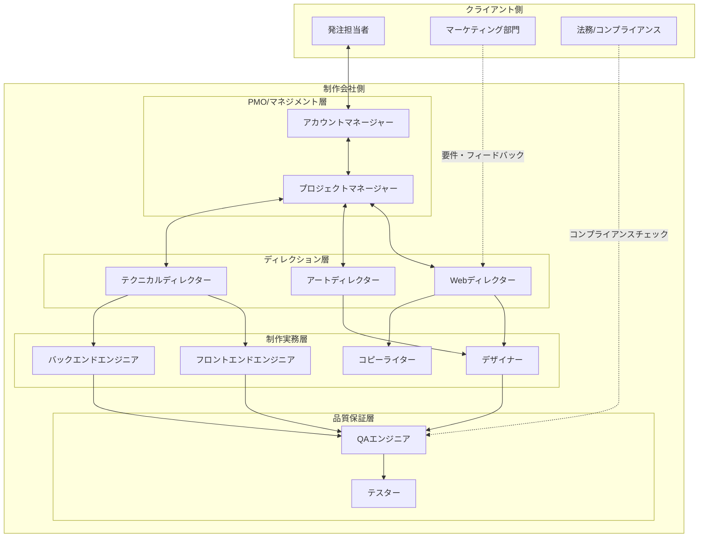
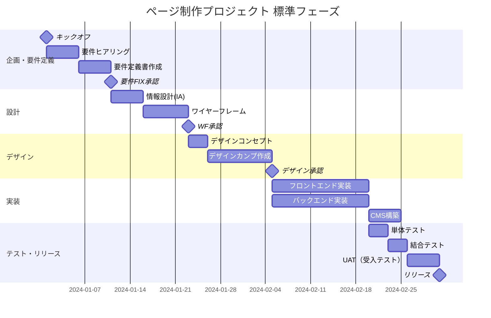
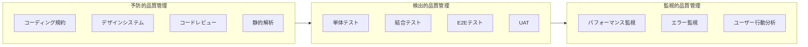
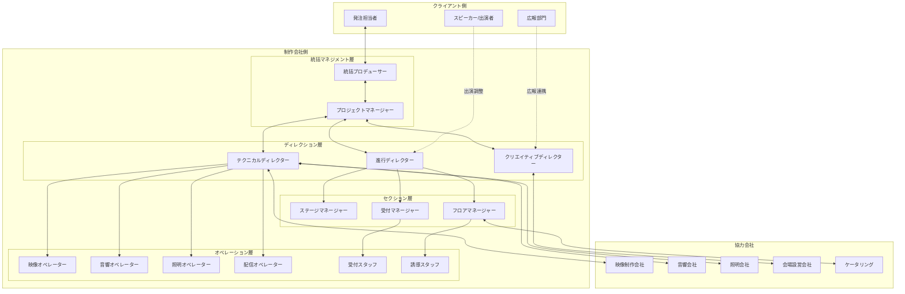
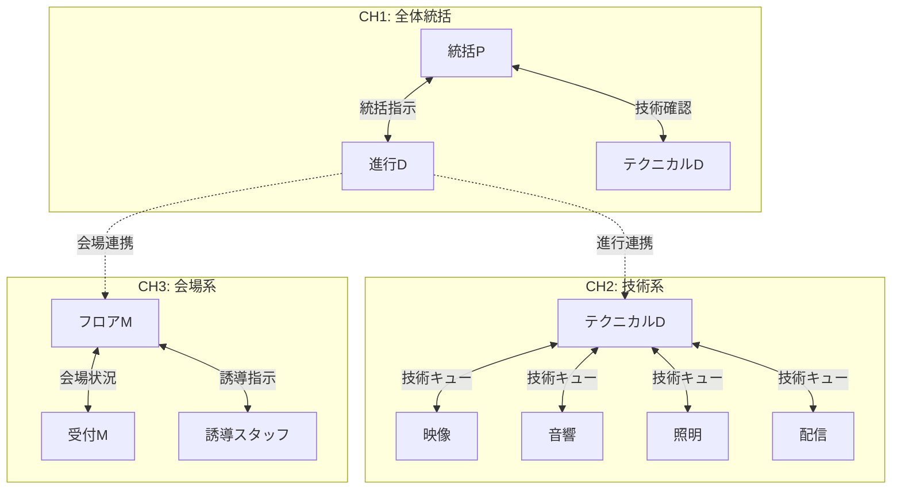
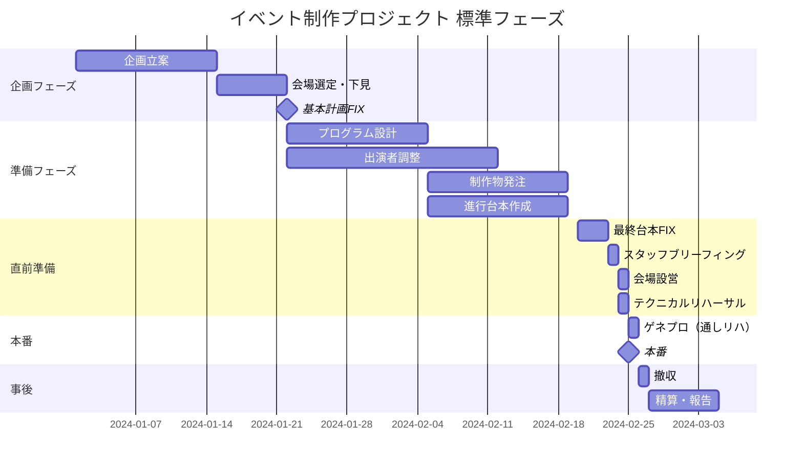
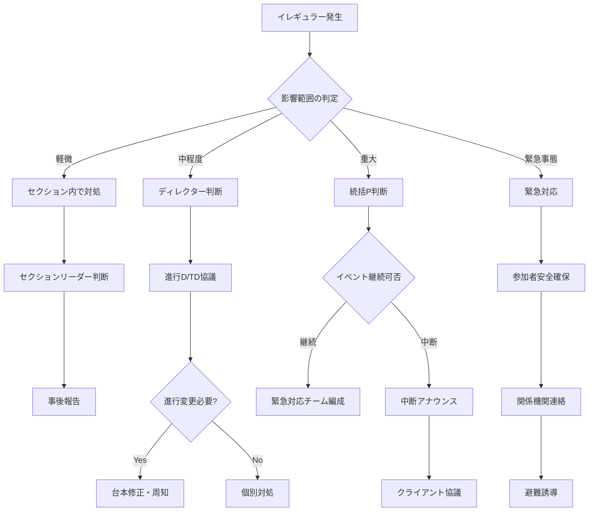
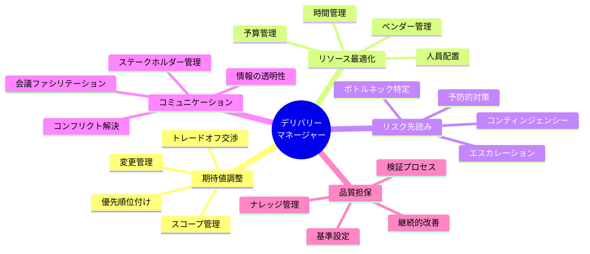
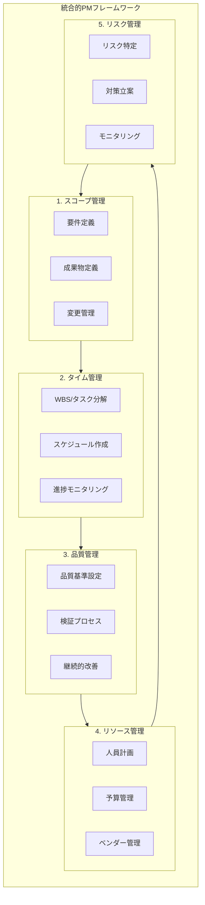

# デリバリー体制・プロジェクトマネジメント標準化レポート
## ページ制作（Web Delivery）& イベントサポート（Event Delivery）

---

## 目次

1. [エグゼクティブサマリー](#1-エグゼクティブサマリー)
2. [ページ制作（Web Delivery）における標準体制](#2-ページ制作web-deliveryにおける標準体制)
3. [イベントサポート（Event Delivery）における標準体制](#3-イベントサポートevent-deliveryにおける標準体制)
4. [領域比較と統合的PMの要諦](#4-領域比較と統合的pmの要諦)

---

## 1. エグゼクティブサマリー

### 背景と目的

本レポートは、デジタルエージェンシーおよびイベントプロダクションにおける「ページ制作（Web/LP制作）」および「イベントサポート（運営/進行管理）」の2領域について、**エンタープライズレベルで採用される標準的なデリバリー体制とプロジェクトマネジメント手法**を体系的に整理したものである。

### 主要な知見

| 観点 | ページ制作（Web） | イベントサポート |
|------|------------------|------------------|
| **時間特性** | 非同期的・反復可能 | 同期的・一発勝負 |
| **品質保証** | テスト自動化・段階的レビュー | リハーサル・想定問答 |
| **リカバリー** | リリース後も修正可能 | 当日の即応力が生命線 |
| **管理ツール** | WBS・ガントチャート・バックログ | 香盤表・進行台本・動線図 |
| **コミュニケーション** | ドキュメントベース（非同期） | インカム・対面（リアルタイム） |

### 統合的PMに求められる能力

両領域に共通して求められるデリバリー能力は以下の3点に集約される：

1. **期待値調整能力（Expectation Management）** - スコープ・品質・納期のバランス交渉
2. **リソース最適化能力** - 人員・予算・時間の戦略的配分
3. **リスク先読み能力** - ボトルネック特定と予防的対策の実行

---

## 2. ページ制作（Web Delivery）における標準体制

### 2.1 体制図モデル

### 2.2 主要な役割と責務（RACI観点）

#### 役割定義一覧

| 役割 | 英語表記 | 主要責務 | RACI区分 |
|------|----------|----------|----------|
| **アカウントマネージャー** | Account Manager | クライアントリレーション、契約管理、追加受注 | I（情報共有） |
| **プロジェクトマネージャー** | Project Manager | 全体進行管理、予算管理、リスク管理、ステークホルダー調整 | A（説明責任） |
| **Webディレクター** | Web Director | 要件定義、情報設計、ワイヤーフレーム、制作進行管理 | A/R |
| **アートディレクター** | Art Director | ビジュアルコンセプト設計、デザイン品質管理 | A（デザイン領域） |
| **テクニカルディレクター** | Technical Director | 技術選定、アーキテクチャ設計、実装品質管理 | A（技術領域） |
| **デザイナー** | Designer | UIデザイン、グラフィック制作 | R（実行責任） |
| **フロントエンドエンジニア** | Frontend Engineer | HTML/CSS/JS実装、UI実装 | R |
| **バックエンドエンジニア** | Backend Engineer | サーバーサイド実装、API開発、DB設計 | R |
| **コピーライター** | Copywriter | 原稿作成、UXライティング | R |
| **QAエンジニア** | QA Engineer | テスト設計、品質検証、バグ管理 | R/A（品質領域） |

#### RACIチャート（主要成果物別）

| 成果物/タスク | PM | WD | AD | TD | DS | FE | BE | QA |
|--------------|----|----|----|----|----|----|----|----|
| 要件定義書 | A | R | C | C | I | I | I | I |
| ワイヤーフレーム | I | A/R | C | C | C | I | I | I |
| デザインカンプ | I | A | A | C | R | I | I | I |
| コーディング | I | I | I | A | I | R | R | C |
| テスト計画 | A | C | I | C | I | C | C | R |
| リリース判定 | A | R | R | R | I | R | R | R |

> **凡例**: R=Responsible（実行責任）, A=Accountable（説明責任）, C=Consulted（相談）, I=Informed（情報共有）

### 2.3 標準ワークフローと管理ポイント

#### フェーズ別管理ポイント

##### Phase 1: 企画・要件定義（Discovery）

| 項目 | 内容 |
|------|------|
| **目的** | プロジェクトゴールの明確化、スコープ合意 |
| **主要成果物** | プロジェクト憲章、要件定義書、RFP回答書 |
| **会議体** | キックオフMTG、要件ヒアリング会議 |
| **承認マイルストーン** | 要件FIX承認 |
| **リスクポイント** | 要件の曖昧さ、ステークホルダー不一致 |

**チェックリスト:**
- [ ] プロジェクト目的・KPIの明文化
- [ ] ターゲットユーザーの定義
- [ ] 機能要件・非機能要件の洗い出し
- [ ] 制約条件（予算・納期・技術）の確認
- [ ] 承認フロー・権限者の特定

##### Phase 2: 設計（Design）

| 項目 | 内容 |
|------|------|
| **目的** | 情報構造・画面構成の確定 |
| **主要成果物** | サイトマップ、ワイヤーフレーム、画面遷移図 |
| **会議体** | IA（情報設計）レビュー、WFレビュー |
| **承認マイルストーン** | ワイヤーフレームFIX |
| **リスクポイント** | 後戻りコスト、認識齟齬 |

**チェックリスト:**
- [ ] サイト全体のIA（情報アーキテクチャ）設計
- [ ] 主要ページのワイヤーフレーム作成
- [ ] ユーザーフロー・画面遷移の定義
- [ ] CMS要件の具体化
- [ ] SEO/アクセシビリティ要件の反映

##### Phase 3: ビジュアルデザイン（Visual Design）

| 項目 | 内容 |
|------|------|
| **目的** | ブランドに沿ったビジュアル表現の確定 |
| **主要成果物** | デザインカンプ、スタイルガイド、アセット一式 |
| **会議体** | デザインレビュー、ブランドチェック |
| **承認マイルストーン** | デザインFIX |
| **リスクポイント** | 主観的フィードバックの収束困難 |

**チェックリスト:**
- [ ] デザインコンセプト・ムードボードの作成
- [ ] トップページ＋主要ページのカンプ作成
- [ ] レスポンシブ対応デザインの作成
- [ ] インタラクション・アニメーション定義
- [ ] デザインシステム/UIコンポーネント設計

##### Phase 4: 実装（Development）

| 項目 | 内容 |
|------|------|
| **目的** | 設計・デザインの技術的実現 |
| **主要成果物** | ソースコード、テスト環境、技術ドキュメント |
| **会議体** | デイリースタンドアップ、スプリントレビュー |
| **承認マイルストーン** | 開発完了・テスト環境公開 |
| **リスクポイント** | 技術的負債、スコープクリープ |

**チェックリスト:**
- [ ] 開発環境・Git運用ルールの整備
- [ ] フロントエンド実装（HTML/CSS/JS）
- [ ] バックエンド実装（サーバーサイド・API）
- [ ] CMS構築・テンプレート実装
- [ ] コードレビューの実施

##### Phase 5: テスト・品質保証（QA）

| 項目 | 内容 |
|------|------|
| **目的** | 品質基準の充足確認 |
| **主要成果物** | テスト計画書、バグ管理表、テスト報告書 |
| **会議体** | バグトリアージ会議、リリース判定会議 |
| **承認マイルストーン** | リリース判定承認 |
| **リスクポイント** | 致命的バグの見落とし、リグレッション |

**チェックリスト:**
- [ ] テストケース作成・実行
- [ ] クロスブラウザ/デバイステスト
- [ ] パフォーマンステスト（Core Web Vitals）
- [ ] セキュリティテスト
- [ ] アクセシビリティテスト

##### Phase 6: リリース・運用移行（Release & Transition）

| 項目 | 内容 |
|------|------|
| **目的** | 本番公開と安定運用への移行 |
| **主要成果物** | リリース手順書、運用マニュアル、引継ぎ資料 |
| **会議体** | リリース判定会議、運用引継ぎ会議 |
| **承認マイルストーン** | 本番リリース完了 |
| **リスクポイント** | リリース障害、運用ノウハウの断絶 |

**チェックリスト:**
- [ ] リリース手順書の作成・リハーサル
- [ ] 本番環境へのデプロイ
- [ ] DNS切り替え・SSL証明書確認
- [ ] 運用監視体制の構築
- [ ] 運用マニュアル・FAQ作成

### 2.4 品質管理（QA）とリスクヘッジ

#### 品質管理フレームワーク

#### 主要な品質指標（KPI）

| カテゴリ | 指標 | 目標値（例） |
|----------|------|-------------|
| **パフォーマンス** | LCP（Largest Contentful Paint） | < 2.5秒 |
| | FID（First Input Delay） | < 100ms |
| | CLS（Cumulative Layout Shift） | < 0.1 |
| **アクセシビリティ** | WCAG 2.1準拠レベル | AA以上 |
| **SEO** | Lighthouse SEOスコア | 90以上 |
| **セキュリティ** | 脆弱性診断結果 | 高・重大：0件 |

#### リスク管理マトリクス

| リスク項目 | 発生確率 | 影響度 | 対策 |
|-----------|---------|--------|------|
| 要件の後出し・変更 | 高 | 高 | 変更管理プロセスの厳格化、バッファ確保 |
| キーパーソンの離脱 | 中 | 高 | ドキュメント整備、クロストレーニング |
| 技術的難易度の見積もり誤り | 中 | 中 | PoC実施、技術検証フェーズの設置 |
| 外部サービス依存のトラブル | 低 | 高 | フォールバック設計、SLA確認 |
| セキュリティインシデント | 低 | 極高 | セキュリティテスト必須化、脆弱性診断 |

---

## 3. イベントサポート（Event Delivery）における標準体制

### 3.1 体制図モデル

### 3.2 主要な役割と責務

#### 役割定義一覧

| 役割 | 英語表記 | 主要責務 | 当日の位置 |
|------|----------|----------|-----------|
| **統括プロデューサー** | Executive Producer | 全体統括、クライアント折衝、最終意思決定 | 本部/クライアント席近傍 |
| **プロジェクトマネージャー** | Project Manager | 予算管理、スケジュール管理、ベンダー管理 | 本部 |
| **進行ディレクター** | Show Director | 進行台本作成、キュー出し、タイムキープ | 進行卓/副調整室 |
| **テクニカルディレクター** | Technical Director | 技術設計、機材手配、技術トラブル対応 | 技術卓/調整室 |
| **クリエイティブディレクター** | Creative Director | 演出設計、空間デザイン、映像演出 | 本部/会場内巡回 |
| **ステージマネージャー** | Stage Manager | 舞台上の進行管理、出演者誘導 | 舞台袖 |
| **フロアマネージャー** | Floor Manager | 客席・動線管理、観客対応 | 客席エリア |
| **受付マネージャー** | Registration Manager | 受付運営、参加者管理 | 受付エリア |

#### 当日の指揮系統（インカム系統図）

### 3.3 事前準備〜当日運営のワークフロー

#### 全体タイムライン

#### フェーズ別詳細

##### Phase 1: 企画（Planning）- 本番3〜6ヶ月前

| 項目 | 内容 |
|------|------|
| **目的** | イベントコンセプト・基本計画の確定 |
| **主要成果物** | 企画書、会場候補リスト、概算見積 |
| **会議体** | 企画会議、会場下見 |
| **管理ドキュメント** | 企画書、予算計画書 |

**チェックリスト:**
- [ ] イベント目的・ゴールの明確化
- [ ] ターゲット参加者の定義
- [ ] 開催形式の決定（リアル/オンライン/ハイブリッド）
- [ ] 会場候補の選定・下見
- [ ] 概算予算の策定

##### Phase 2: 準備（Preparation）- 本番1〜3ヶ月前

| 項目 | 内容 |
|------|------|
| **目的** | 詳細計画の策定と各種手配 |
| **主要成果物** | 進行台本、香盤表、各種発注書 |
| **会議体** | 定例進捗会議、出演者打合せ |
| **管理ドキュメント** | 進行台本、香盤表、スタッフ配置図 |

**主要ドキュメント一覧:**

| ドキュメント名 | 用途 | 主管 |
|---------------|------|------|
| **進行台本** | 時系列での進行内容・キュー | 進行D |
| **香盤表（キューシート）** | 各セクションの動作タイミング | 進行D |
| **タイムテーブル** | 公開用スケジュール | PM |
| **会場図面・レイアウト図** | 空間配置 | CD/TD |
| **動線図** | 人の流れ | FM |
| **スタッフ配置図** | 人員配置 | PM |
| **機材リスト** | 技術機材一覧 | TD |
| **通信系統図** | インカム・連絡体制 | TD |
| **緊急連絡網** | 緊急時連絡先 | PM |

##### Phase 3: 直前準備（Pre-Production）- 本番1週間〜前日

| 項目 | 内容 |
|------|------|
| **目的** | 最終確認と本番準備 |
| **主要成果物** | 最終版台本、ブリーフィング資料 |
| **会議体** | スタッフブリーフィング、技術打合せ |
| **管理ドキュメント** | 最終台本、当日マニュアル |

**チェックリスト:**
- [ ] 最終版進行台本の配布
- [ ] 全スタッフブリーフィングの実施
- [ ] 機材搬入・設営
- [ ] テクニカルリハーサル（テクリハ）
- [ ] 出演者リハーサル

##### Phase 4: 本番当日（Show Day）

**当日タイムライン例（終日イベント）:**

| 時刻 | 内容 | 主管 |
|------|------|------|
| 06:00 | スタッフ集合・朝礼 | PM |
| 06:30 | 最終設営・機材チェック | TD |
| 08:00 | ゲネプロ（通しリハ） | 進行D |
| 09:30 | 本番前最終確認 | 統括P |
| 10:00 | 開場・受付開始 | 受付M |
| 10:30 | **本番開始** | 進行D |
| 12:00 | 昼休憩（ローテーション） | FM |
| 17:00 | **本番終了** | 進行D |
| 17:30 | 撤収開始 | TD |
| 20:00 | 完全撤収 | PM |

##### Phase 5: 事後（Post-Event）- 本番後1〜2週間

| 項目 | 内容 |
|------|------|
| **目的** | 精算と振り返り |
| **主要成果物** | 実施報告書、精算書、振り返りレポート |
| **会議体** | 振り返り会議 |

**チェックリスト:**
- [ ] 参加者数・アンケート集計
- [ ] 各社への支払い精算
- [ ] 実施報告書の作成
- [ ] KPT（Keep/Problem/Try）振り返り
- [ ] ナレッジの蓄積・共有

### 3.4 イレギュラー対応と指揮系統

#### イレギュラー対応フローチャート

#### 想定イレギュラーと対応方針

| カテゴリ | 想定事象 | 対応方針 | 判断者 |
|----------|----------|----------|--------|
| **出演者関連** | 登壇者の遅刻・欠席 | プログラム順序入替、代役手配 | 進行D |
| | 登壇者の体調不良 | 短縮対応、救護手配 | 統括P |
| **技術関連** | 映像トラブル | バックアップ系統への切替 | TD |
| | 音声トラブル | 予備マイク使用、一時中断 | TD |
| | 配信トラブル | 録画放送への切替、再配信告知 | TD |
| **会場関連** | 参加者急増/減 | レイアウト変更、追加席設置 | FM |
| | 空調/電源トラブル | 会場管理者連絡、一時中断 | PM |
| **緊急事態** | 火災・地震 | 避難誘導、緊急放送 | 統括P |
| | 急病人発生 | 救護対応、119番通報 | 最寄りスタッフ |
| | 不審者対応 | 警備連絡、隔離対応 | FM/警備 |

#### エスカレーションルール

1. **第1段階（セクション内解決）**: 該当セクションリーダーの判断で即座に対処
2. **第2段階（ディレクター協議）**: 進行に影響がある場合、進行D/TDに即時報告
3. **第3段階（統括判断）**: イベント全体に影響する場合、統括Pが最終判断
4. **第4段階（クライアント協議）**: イベント中止・大幅変更が必要な場合

---

## 4. 領域比較と統合的PMの要諦

### 4.1 Webとイベントの管理手法比較

#### 基本特性比較

| 比較軸 | ページ制作（Web） | イベントサポート |
|--------|------------------|------------------|
| **時間特性** | 非同期的・分散作業 | 同期的・集中作業 |
| **成果物** | デジタル資産（永続的） | 体験（一過性） |
| **品質保証** | テスト・レビュー | リハーサル・想定問答 |
| **修正可能性** | リリース後も修正可能 | 本番は一発勝負 |
| **失敗コスト** | 段階的に修正可能 | 即座に影響顕在化 |

#### プロジェクト管理手法比較

| 項目 | ページ制作（Web） | イベントサポート |
|------|------------------|------------------|
| **典型的手法** | ウォーターフォール/アジャイル | クリティカルパス法 |
| **スケジュール管理** | ガントチャート、スプリント | 香盤表、タイムテーブル |
| **タスク管理** | WBS、バックログ | 進行台本、チェックリスト |
| **進捗会議** | 定例MTG、デイリースタンドアップ | 定例MTG、当日朝礼 |
| **変更管理** | 変更要求書、バージョン管理 | 台本改訂、差分共有 |

#### コミュニケーション比較

| 項目 | ページ制作（Web） | イベントサポート |
|------|------------------|------------------|
| **主要ツール** | Slack、Teams、メール | インカム、トランシーバー |
| **ドキュメント共有** | クラウドストレージ、Git | 紙台本、クラウド |
| **タイミング** | 非同期中心 | リアルタイム中心 |
| **粒度** | 詳細なテキストベース | 簡潔な音声コマンド |

#### リスク管理比較

| リスク種別 | ページ制作（Web） | イベントサポート |
|-----------|------------------|------------------|
| **スケジュールリスク** | バッファ確保、スコープ調整 | 予備時間設定、プログラム調整 |
| **品質リスク** | テスト自動化、段階レビュー | リハーサル徹底、バックアップ体制 |
| **人的リスク** | クロストレーニング、ドキュメント | 代役設定、マニュアル整備 |
| **技術リスク** | PoC、段階リリース | 予備機材、冗長構成 |

### 4.2 共通して求められるデリバリー能力

#### コアコンピテンシー

#### 1. 期待値調整能力（Expectation Management）

**定義:** ステークホルダーの期待とプロジェクト現実のギャップを認識し、適切にコントロールする能力

**具体的スキル:**
- スコープの明確な定義と合意形成
- QCD（品質・コスト・納期）トレードオフの可視化と交渉
- 変更要求の影響分析と適切な判断
- 「できること」と「できないこと」の明確な伝達

**実践手法:**
- プロジェクト憲章でのゴール明文化
- WBS/スコープ定義書による範囲の明確化
- 変更管理プロセスの確立
- 定期的な進捗報告とリスク共有

#### 2. リソース最適化能力（Resource Optimization）

**定義:** 限られた人・モノ・カネ・時間を最大効果で活用する能力

**具体的スキル:**
- 適材適所の人員配置
- 予算のバランス配分と執行管理
- クリティカルパスの特定と重点管理
- 外部リソース（ベンダー・フリーランス）の効果的活用

**実践手法:**
- リソースカレンダーによる稼働管理
- EVMによる予算執行管理
- ベンダー評価・選定基準の確立
- バッファ管理（時間・予算）

#### 3. リスク先読み能力（Proactive Risk Management）

**定義:** 潜在的な問題を事前に察知し、予防的対策を講じる能力

**具体的スキル:**
- プロジェクト特有のリスク要因の特定
- 発生確率×影響度によるリスク評価
- コンティンジェンシープラン（代替案）の策定
- 早期警戒指標の設定とモニタリング

**実践手法:**
- リスク登録簿の作成・更新
- 定期的なリスクレビュー
- 想定問答集（Q&A）の準備
- バックアップ体制の構築

#### 4. ファシリテーション・コミュニケーション能力

**定義:** 多様なステークホルダー間の認識を揃え、協働を促進する能力

**具体的スキル:**
- 会議の効率的なファシリテーション
- 複雑な情報のわかりやすい可視化
- コンフリクト（対立）の建設的解決
- 適切なエスカレーション判断

**実践手法:**
- 会議体の設計（目的・参加者・頻度）
- RAIDログ（Risk/Action/Issue/Decision）の運用
- ステークホルダーマップの作成
- コミュニケーション計画の策定

### 4.3 統合的PMフレームワーク

両領域を横断して活用できる統合的なPMフレームワークとして、以下の5つの管理領域を提案する。

---

## 付録

### A. 用語集

| 用語 | 読み | 説明 |
|------|------|------|
| WBS | ダブリュービーエス | Work Breakdown Structure。作業分解構成図 |
| RACI | レイシー | Responsible/Accountable/Consulted/Informedの責任分担マトリクス |
| QCD | キューシーディー | Quality（品質）/Cost（コスト）/Delivery（納期） |
| IA | アイエー | Information Architecture。情報設計 |
| UAT | ユーエーティー | User Acceptance Test。受入テスト |
| 香盤表 | こうばんひょう | イベントの時系列進行と各セクションの動作を一覧化した表 |
| 進行台本 | しんこうだいほん | イベントの詳細な進行内容・セリフ・キューを記載した台本 |
| テクリハ | てくりは | テクニカルリハーサル。技術面の確認を主目的としたリハーサル |
| ゲネプロ | げねぷろ | 本番同様の通しリハーサル（独：Generalprobe） |
| インカム | いんかむ | インターカム。イベント現場での無線通信システム |

### B. 参考フレームワーク・資格

| 名称 | 概要 | 領域 |
|------|------|------|
| PMBOK | プロジェクトマネジメント知識体系 | 共通 |
| PRINCE2 | プロセスベースのPM手法 | 共通 |
| アジャイル/スクラム | 反復的・漸進的開発手法 | Web制作 |
| ITIL | ITサービスマネジメント | Web運用 |
| イベント検定 | 日本イベント産業振興協会認定資格 | イベント |

---

## 文書情報

| 項目 | 内容 |
|------|------|
| 文書タイトル | デリバリー体制・プロジェクトマネジメント標準化レポート |
| バージョン | 1.0 |
| 作成日 | 2026-01-23 |
| 対象領域 | ページ制作（Web Delivery）、イベントサポート（Event Delivery） |
| 想定読者 | PM、ディレクター、制作管理者、経営層 |
